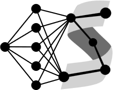
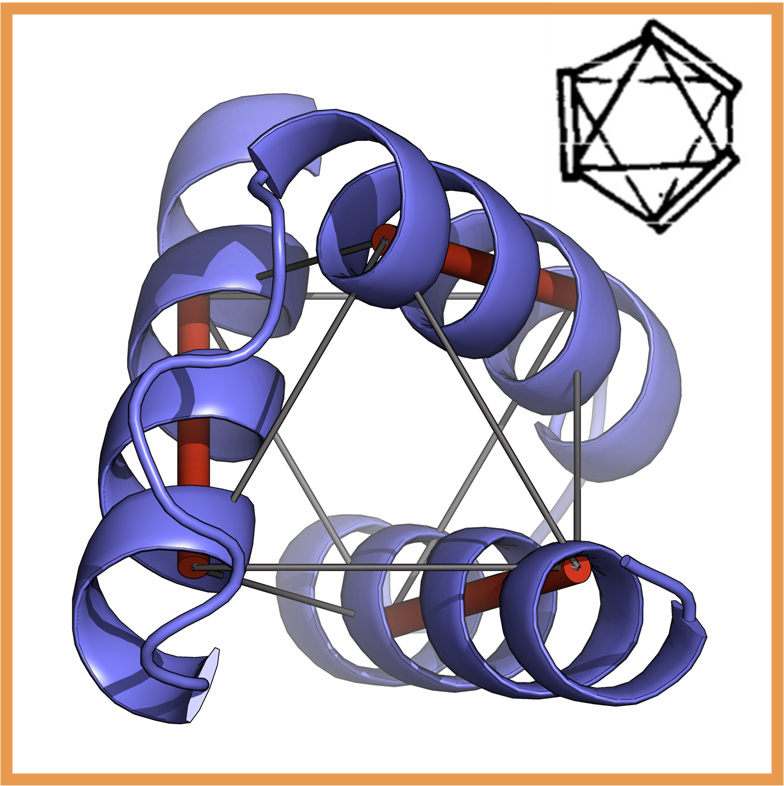
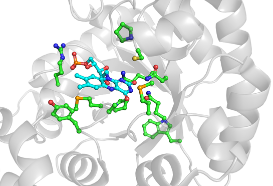
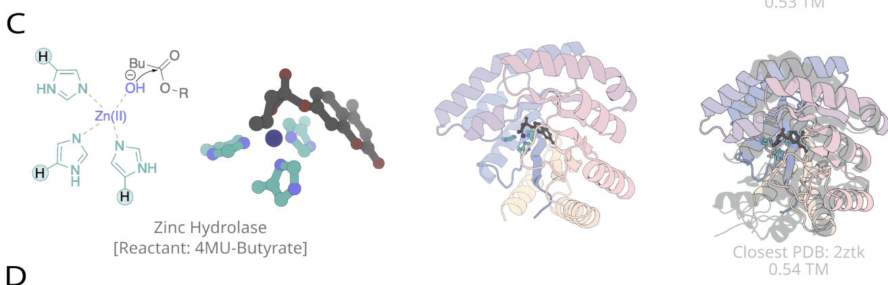

Of course! Sticking to your content, here is a version that incorporates more modern and stylish Markdown features like badges, emojis, and collapsible sections to enhance visual appeal and readability, while preserving your excellent structure and descriptions.

This version uses HTML within Markdown for finer control over layout, which renders perfectly on platforms like GitHub.

***

<div align="center">
  
  <h1>Flavo-Mandelate Binder Design Hackathon</h1>
  <p>
    
    
    
  </p>
</div>

Welcome, innovators and protein designers, to the **Wells Wood Research Group Hackathon**! We're thrilled to have you join us for an exciting session of computational protein design. Over the next few days, we'll be tackling a grand challenge at the intersection of enzymology and *de novo* design.

---

## 🎯 The Grand Challenge

Our collective goal is to push the boundaries of computational protein design. Everyone will be working towards the same high-level objective:

> ### Design a protein that:
> 1.  **Binds a Flavin** (FAD, FMN, or Lumiflavin)
> 2.  **Binds Mandelate** in a potentially catalytic orientation

To tackle this, we have organized into three distinct, synergistic sub-projects. Choose the one that excites you the most!

---

## 🚀 The Projects

Each project leverages a different state-of-the-art methodology to approach our grand challenge. Find a high-level summary below, with full details for each project further down.

| Project | Core Methodologies                                     | Key Concept                                                 |
| :------ | :----------------------------------------------------- | :---------------------------------------------------------- |
| **A**   | `RASSCoL` + `Deltaprot` Scaffolds                      | Repurpose elegant geometric scaffolds for new function.     |
| **B**   | `Ligand Docking` + `AI Sequence Design` (coTIMED/MPNN) | Introduce catalytic activity into natural, photoactive proteins. |
| **C**   | `Theozyme Design` + `RF-Diffusion`                     | Build a novel enzyme from the ground up, starting with chemistry. |

<br>

---

### Project A: RASSCoL on Deltaprot Scaffolds

**Objective: Repurpose geometrically elegant scaffolds for new function using rapid sidechain sampling.**

This project aims to expand the capabilities of `RASSCoL` (a rapid method for sampling sidechains in the presence of ligands) from coiled-coils to globular proteins. We'll be using a fascinating library of "Deltaprot" scaffolds, designed by Tadas (UoE). These are compact α-helical bundles with idealized geometries, making them perfect candidates for swapping out entire helices to create new binding pockets.

-   **Core Method:** `RASSCoL`
-   **Target Ligands:** Lumiflavin (LMF) + Mandelate
-   **Scaffolds:** 30 parametrically designed Deltaprots
-   **Background:** Builds on Kasia's successful work designing LMF-binding coiled-coils.
-   **Key Concept:** Deltaprots are *Compact α-helical bundles that can adopt just 30 deltahedral geometries in which helix axes lie along the edges of idealized polyhedra.

<p align="center">
  
  <br>
  <em>A visualization of a Deltaprot scaffold, highlighting its geometric α-helical arrangement.</em>
</p>

---

### Project B: AI-Enhanced Docking into Natural Flavoproteins

**Objective: Introduce a new catalytic activity into existing, highly photoactive flavoproteins.**

This project starts with a unique dataset of 79 natural flavoproteins, curated by Eugene using ML methods. Experimental work by Harry and Junfeng has shown that several of these proteins are highly fluorescent—a great proxy for photoactivity! The missing piece is substrate binding. Your mission is to engineer it.

-   **Core Methods:** Ligand Docking + AI-powered Sequence Design
-   **Target Ligand:** Mandelate
-   **Scaffolds:** The "Flavin 79" Dataset
-   **AI Tools:** `coTIMED` / `ligandMPNN`
-   **Key Concept:** Introduce a mandelate binding site near the native flavin cofactor to create a novel enzyme from a natural, photoactive scaffold.

<p align="center">
  
  <br>
  <em>The active site of protein 1VHN, a flavoprotein from our dataset, showing the bound FMN cofactor.</em>
</p>

---

### Project C: De Novo Design from First Principles

**Objective: Build a novel enzyme from the ground up, starting with the chemistry of the reaction.**

This project takes a "bottom-up" approach. We begin with a "theozyme"—a precise, geometric arrangement of functional groups needed to stabilize the reaction's transition state. Using QM calculations from Linus and Marta as our guide, we will use generative AI to "hallucinate" protein scaffolds that can perfectly house this catalytic geometry.

-   **Core Methods:** Theozyme placement + Generative Scaffolding + AI Sequence Design
-   **Target Reaction:** LMF + Mandelate
-   **AI Tools:** `RF-Diffusion All Atom`, AI sequence designers
-   **Key Concept:** A theozyme is the minimal catalytic unit of an enzyme. By building a protein around it, we can design for function from first principles.

<p align="center">
  
  <br>
  <em>An illustration from the RFDiffusion paper showing a designed protein scaffold built around a functional motif.</em>
</p>

---

## 🧑‍💻 Getting Started

Ready to dive in? Here’s your checklist:

1.  ✅ **Confirm Your Attendance:** Please let the organizers know you are coming so we can arrange desk space and resources.
2.  💡 **Choose Your Project:** Read the descriptions and let the organizers know your preference.
3.  💻 **Setup Your Environment:**
    -   Access the cluster / required software.
    -   Clone this repository: `git clone [repository-url]`
    -   Install any local tools (e.g., PyMOL, Conda environments).
4.  🤝 **Find Your Team:** Connect with your project lead and teammates!

*If you know anyone who was missed on the initial email, please forward this information to them!*

## 📂 Suggested Repository Structure

<details>
<summary>Click to view the repository file structure</summary>

To keep our work organized, we'll use the following structure. Each project has its own self-contained directory, and we have shared top-level folders for common data and assets.

```
.
├── assets/
│   └── images/ (logos and figures)
│
├── data/
│   ├── ligands/
│   │   ├── FAD.params
│   │   ├── FMN.params
│   │   ├── LMF.params
│   │   └── Mandelate.params
│   └── flavin_79_dataset/
│       └── ... (PDB files and list)
│
├── project_a_rasscol/
│   ├── README.md             # Project-specific instructions
│   ├── inputs/
│   │   └── Deltaprot_scaffolds/
│   │       └── ... (PDB files)
│   ├── notebooks/
│   │   └── analysis.ipynb
│   ├── results/
│   │   └── designs/
│   └── scripts/
│       └── run_rasscol.sh
│
├── project_b_docking_ai/
│   ├── README.md
│   ├── inputs/
│   │   └── selected_proteins/
│   ├── notebooks/
│   │   └── docking_visualization.ipynb
│   ├── results/
│   │   ├── docked_poses/
│   │   └── redesigned_sequences/
│   └── scripts/
│       ├── 01_docking.py
│       └── 02_run_ligandmpnn.sh
│
├── project_c_de_novo/
│   ├── README.md
│   ├── inputs/
│   │   └── theozymes/
│   │       └── lmf_mandelate_ts.pdb
│   ├── notebooks/
│   │   └── design_filtering.ipynb
│   ├── results/
│   │   ├── rfdiffusion_outputs/
│   │   └── final_designs/
│   └── scripts/
│       ├── run_rfdiffusion.sh
│       └── run_proteinmpnn.sh
│
└── README.md                 # This file!
```

</details>

## 📚 Resources & Links

-   **Papers:**
    -   [Murzin & Finkelstein (1988) - Deltahedral Geometries](link-to-paper)
    -   [RFDiffusion Paper](link-to-paper)
    -   [LigandMPNN Paper](link-to-paper)
-   **Tools:**
    -   [RASSCoL Documentation](link-to-tool)
    -   [RFDiffusion GitHub](link-to-tool)
    -   [ORCA QM Software](link-to-tool)

## ❓ Questions?

If you have any questions, please reach out to **Eugene**!

<hr>

<div align="center">
  <h3>Let's build some amazing proteins! 🎉</h3>
</div>